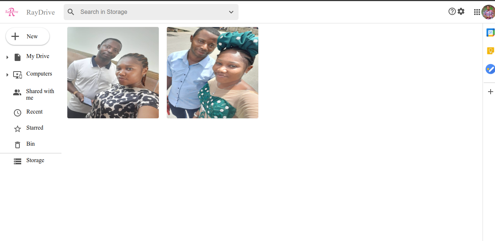

# App Name: storageapp

The app name is RayDrive an online photo storage application build using React and firebase storage system

# Introduction

App link: https://storageapp-83909.web.app/
Project blog articles:
Authors Linkedin: https://www.linkedin.com/in/rowland-oka

# Installation

Clone or get the zip file from the app repository into your local computer, cd into the clone folder to install all dependencies by running the command

### `npm install`.

## Usage of the App

In the project directory, you can run:

### `npm start`

Runs the app in the development mode.\
Open [http://localhost:3000](http://localhost:3000) to view it in your browser.

The page will reload when you make changes.\
You may also see any lint errors in the console.

# Contributing

To improve this app, contributions are highly welcome to add and improve this application, ideas for improvement are welcome.

# Related Projects

Related projects exist such as:
Dropbox, Google Drive etc

# Author:

1.  Rowland Oka <https://github.com/Rowlandoka/>

# License:

This project is licensed under the MIT licensing.
